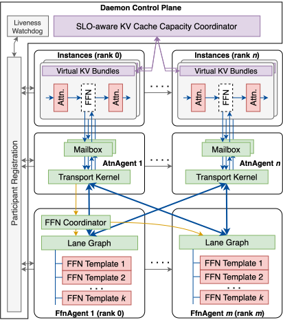

<h1 align="center">CrossPool</h1>

CrossPool is a serving system for co-locating multiple SGLang models when
user-driven KV Cache demand and model-driven FFN weight requirements do not
line up.

## Why CrossPool?

KV Cache and FFN weights/execution are governed by different sizing axes:

| Resource | Main sizing driver | CrossPool treatment |
| --- | --- | --- |
| Attention and KV Cache | Active requests, context lengths, and generation histories | SGLang keeps logical cache ownership; physical backing can be lent and reclaimed among Instances on one attention GPU. |
| FFN weights and execution | Model layer geometry, weight size, and FFN parallelism | FfnAgents retain model-specific true-TP shards on a shared FFN execution tier. |

A conventional co-located deployment binds these two axes to the same process and
GPU reservation. One model may need large KV capacity while another mainly
contributes resident FFN weights, yet each Instance must reserve both sides
independently.

CrossPool separates the placement and sizing decisions without changing
SGLang's request semantics. It shares FFN execution infrastructure and
reallocates physical KV backing across co-located Instances. Logical KV contents
and prefix caches remain isolated; CrossPool shares execution infrastructure and
physical capacity, not cache contents.

## Architecture at a glance

<p align="center">
  
</p>

The daemon control plane registers participants, coordinates SLO-aware KV
capacity, and watches participant liveness. Each SGLang Instance Rank keeps
attention and logical KV/prefix-cache ownership, then sends FFN work through a
rank-local mailbox to its AtnAgent's Transport Kernel.

FfnAgents retain model-specific FFN weight shards as reusable GraphTemplates and
replay them through per-lane CUDA Graphs. The Fabric carries the rank-local work
between the AtnAgents and FfnAgents; physical KV backing can move between
co-located Instances without sharing logical KV contents. See the [system
overview](docs/designs/overview.md) for complete process roles, request flow,
and readiness contracts.

## Highlights

- **Seamless SGLang integration:** a pinned SGLang plugin installs
  architecture-specific adapters without replacing SGLang's request or KV Cache
  runtime.
- **Independent resource placement:** attention/KV and FFN/weight sides can be
  configured and sized independently for co-located models.
- **SLO-aware elastic KV Cache backing:** stable attention-side virtual addresses
  allow physical KV capacity to move between co-located Instances while SGLang
  keeps logical allocation and prefix-cache ownership.
- **Layer-wise FFN execution:** FfnAgents retain model-specific weight shards
  and execute model-defined FFN layers through GraphTemplates based on layer
  signatures.

## Requirements

- Linux on x86-64
- [uv](https://docs.astral.sh/uv/) 0.12.17 or newer
- An uv-managed Python 3.12 interpreter
- CUDA Toolkit 13.2 and CCCL 3.2
- NVIDIA GPUs able to execute the selected kernels and CUDA graphs, with CUDA
  IPC and NVSHMEM access required by the selected topology; the example uses
  one attention-side GPU and one FFN-side GPU
- An externally managed CUDA MPS controller for runtime and GPU validation
- Local model weights for serving and model-dependent validation

The native extension is built through uv and scikit-build-core, which obtains
suitable CMake and Ninja versions when needed. The system CUDA Toolkit provides
the native compiler and CCCL. CUDA bindings, Torch, SGLang, and the NVIDIA
NVSHMEM runtime are direct project dependencies. uv uses the interpreter pinned
in `.python-version` with managed Python downloads enabled. NVSHMEM runs through
the native C++/CUDA implementation; Python NVSHMEM bindings are not required.

## Quick Start

Follow the [two-GPU Qwen3-0.6B quick start](docs/tutorials/quick-start.md) to
configure a local checkpoint, start MPS and the four serving roles, send an HTTP
request through real FFN execution, and shut everything down in order.

## Configuration

For the complete user-facing reference, see
[Configuration](docs/configuration.md). Start from
[`configs/xpool.example.toml`](configs/xpool.example.toml) and
[`.env.example`](.env.example); the [Quick Start](docs/tutorials/quick-start.md)
shows a complete two-GPU setup.

## SGLang Integration

CrossPool integrates with SGLang through architecture-discovered adapters. The
model architecture in `config.json` selects the adapter, while the configured
model ID resolves its weights. SGLang continues to own request scheduling,
attention, KV Cache, and output processing; CrossPool adds the shared FFN
execution path and elastic physical KV Cache backing. See
[Supported Models](docs/supported-models.md) for currently qualified model IDs.

## Validation and Development

`xtest run` is the canonical composition root. It runs native CTest,
Unit, Integration, and E2E stages in their accepted order, schedules GPU work
against explicit resource requirements, and retains artifacts under
`.xpool-cache/test-runs/`.

```bash
if [ -f .env ]; then export UV_ENV_FILE="$PWD/.env"; fi

# Complete resource-eligible suite.
uv run xtest run

# Selected canonical stages.
uv run xtest run --suite cext --suite integration
uv run xtest run --suite e2e --strict-requirements
```

See [tests/README.md](tests/README.md) for suite placement, requirements, and
commands, and [tests/harness/README.md](tests/harness/README.md) for process,
GPU lease, endpoint, and artifact ownership.

CMake uses ccache for C, C++, and CUDA when available and no compiler launcher
is already configured. To disable it for a build, add
`--config-settings-package xpool:cmake.define.XPOOL_ENABLE_CCACHE=OFF`
to the development-environment sync command above.

## Repository Guide

- [`docs/designs/README.md`](docs/designs/README.md) maps the current implemented
  architecture.
- [`docs/plans/README.md`](docs/plans/README.md) maps candidate workstreams and
  their technical relationships.
- [`CONTEXT.md`](CONTEXT.md) defines the CrossPool domain language.
- [`src/xpool/`](src/xpool/) contains configuration, runtime roles, the daemon,
  SGLang integration, and Python/native boundaries.
- [`src/cext-include/xpool/`](src/cext-include/xpool/) and
  [`src/cext/`](src/cext/) contain the C++/CUDA Transport and Fabric data plane.
- [`tests/`](tests/) contains the native, Unit, Integration, and E2E validation
  layers and their reusable harnesses.
- [`docs/code-style.md`](docs/code-style.md) defines repository-wide coding
  conventions.

## License

CrossPool is available under the [MIT License](LICENSE).
